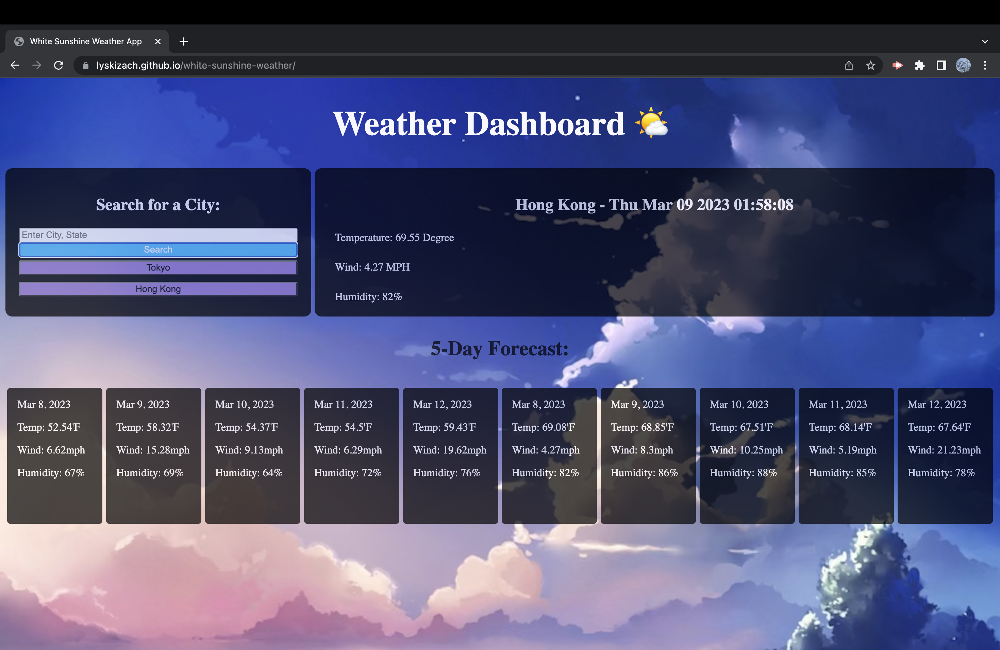

# white-sunshine-weather

In this challenge, I created a weather application using the Openweather API. The application can take user input and display the current weather and time for that location along with a 5 day forecast.

## Screenshot of Deployed Link
""

## URL
https://lyskizach.github.io/white-sunshine-weather/